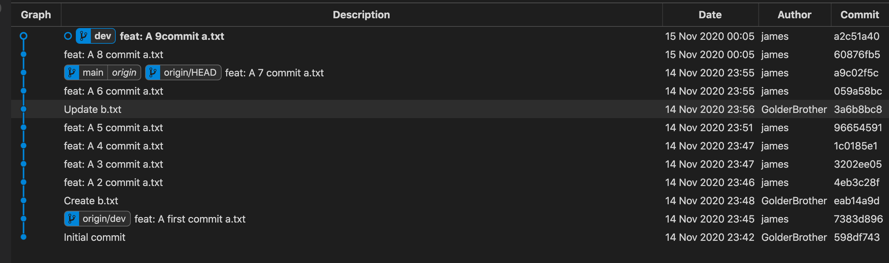
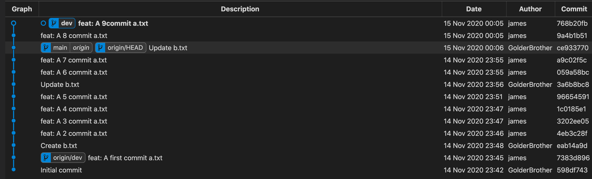

# git rebase 学习

> This is a demo for git learning rebase 

a.txt文件commit之后，rebase main 之前是这样的 👇

a.txt文件commit之后，rebase main 之后是这样的 👇

发现采用rebase的方式进行分支合并，整个master分支并没有多出一个新的commit，原来dev分支上的那几次（C3，C4，C5）commit在rebase之后其hash值发生了变化，不在是当初在dev分支上提交的时候的hash值了，但是提交的内容被全部复制保留了，并且整个master分支的commit记录呈线性记录

## 总结

git merge 操作合并分支会让两个分支的每一次提交都按照提交时间（并不是push时间）排序，并且会将两个分支的最新一次commit点进行合并成一个新的commit，最终的分支树呈现非整条线性直线的形式

git rebase操作实际上是将当前执行rebase分支的所有基于原分支提交点之后的commit打散成一个一个的patch，并重新生成一个新的commit hash值，再次基于原分支目前最新的commit点上进行提交，并不根据两个分支上实际的每次提交的时间点排序，rebase完成后，切到基分支进行合并另一个分支时也不会生成一个新的commit点，可以保持整个分支树的完美线性

另外值得一提的是，当我们开发一个功能时，可能会在本地有无数次commit，而你实际上在你的master分支上只想显示每一个功能测试完成后的一次完整提交记录就好了，其他的提交记录并不想将来全部保留在你的master分支上，那么rebase将会是一个好的选择，他可以在rebase时将本地多次的commit合并成一个commit，还可以修改commit的描述等

## 最后

如果你想要你的分支树呈现简洁，不罗嗦，线性的commit记录，那就采用rebase

